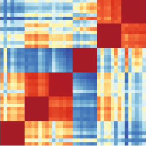
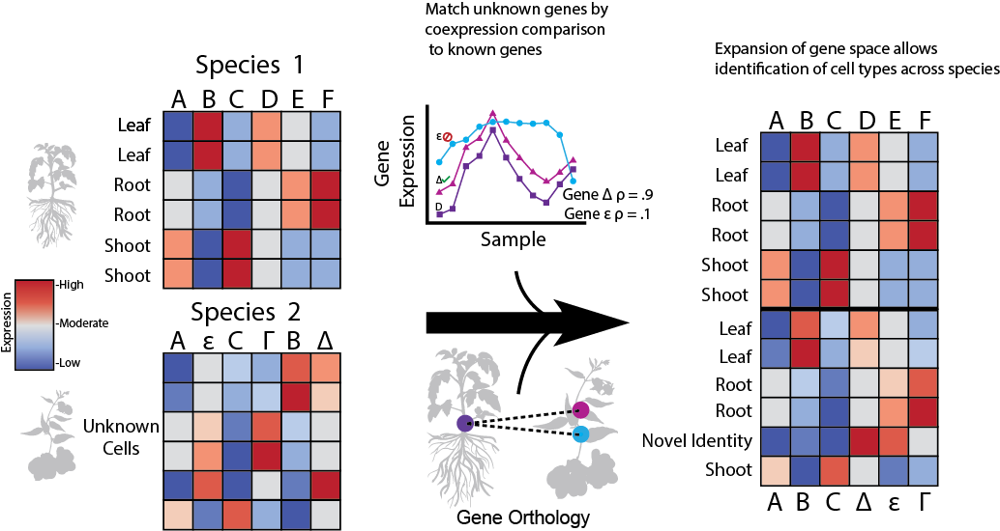

<!-- Improved compatibility of back to top link: See: https://github.com/othneildrew/Best-README-Template/pull/73 -->

<!--
*** Thanks for checking out the Best-README-Template. If you have a suggestion
*** that would make this better, please fork the repo and create a pull request
*** or simply open an issue with the tag "enhancement".
*** Don't forget to give the project a star!
*** Thanks again! Now go create something AMAZING! :D
-->

<!-- PROJECT SHIELDS -->
<!--
*** I'm using markdown "reference style" links for readability.
*** Reference links are enclosed in brackets [ ] instead of parentheses ( ).
*** See the bottom of this document for the declaration of the reference variables
*** for contributors-url, forks-url, etc. This is an optional, concise syntax you may use.
*** https://www.markdownguide.org/basic-syntax/#reference-style-links
-->

[![MIT License][license-shield]][license-url]
[![LinkedIn][linkedin-shield]][linkedin-url]

<!-- PROJECT LOGO -->
 

  

  <h3 align="center">EPIPHITES: Expression Proxies In Plants Help Integrate Transcribed Expression in Single-cell </h3>

  

    Expand the shared genespace between plant species to improve integration!
     
    <a href="https://gillislab.shinyapps.io/epiphites_v11/"><strong>Go to the website »</strong></a>
     
     
    <a href="https://github.com/gillislab/Coexpression_Proxies/blob/main/Coexpression_network_template.ipynb">Build a new coexpression network</a>
    ·
    <a href="https://www.biorxiv.org/content/10.1101/2023.11.28.569145v1">View the Preprint</a>
    ·
    <a href="https://thedonnellycentre.utoronto.ca/faculty/jesse-gillis">Lab Website and Contact Info</a>
  

<!-- TABLE OF CONTENTS -->

  
Table of Contents

  <ol>
    <li>
      <a href="#about-the-project">About The Project</a>
    </li>
    <li>
      <a href="#getting-started">Getting Started</a>
      <ul>
        <li><a href="#Using Coexpression Proxies for Calculated Species">Using Coexpression Proxies for Calculated Species</a></li>
        <li><a href="#Generating Coexpression Proxies For New Species
">Generating Coexpression Proxies For New Species
</a></li>
      </ul>
    </li>
    <li><a href="#license">License</a></li>
    <li><a href="#contact">Contact</a></li>
    <li><a href="#acknowledgments">Acknowledgments</a></li>
  </ol>

<!-- ABOUT THE PROJECT -->
## About The Project

  

Welcome to EPIPHITES! This project was inspired by a late night trying to help our tireless collaborators. After many months of attempting to get integration of Arabidopsis and Maize data working, we realized that the tiny number of 1-1 genes was majorly impacting integration. To deal with this, we use conservation of coexpression to identify highly similar gene pairs across species, and add them to the 1-1 gene space. Why does this improve integration?

Here's why:
1) All gene expression is highly correlated - gene expression does not look like 20k independent values
2) This correlated expression underlies all single cell analysis - correlated expression enables the clustering that facilliates single cell
3) Coexpression captures both function and regulation, finding good matches for genes across species. Additionally, the one to one genes are not perfect matches either, as they've evovled between species and taken on new functions. This gives flexibility to allow mismatches in both the true 1-1 genes and our coexpression proxies
   
   
    

The best part about EPIPHITES is how easy it is to drop into your existing workflow and see if it improves your results. All you need to do to try it out is pop-over to the Shiny app, download the genelist for your species pair of interest, and give integration a shot with your exisiting workflow! 

(<a href="#readme-top">back to top</a>)

(<a href="#readme-top">back to top</a>)

<!-- GETTING STARTED -->
## Getting Started

### Using Coexpression Proxies for Calculated Species

This will explain how to get started if you are interested in integrating high dimensional data between two of the following species: Zea mays, Oryza sativa, Arabidopsis thaliana, Malus domestica, Sorghum bicolor, Vitis vinifera, Brassica rapa, Glycine max, Medicago truncatula, Nicotiana tabacum, Solanum tuberosum, Brachypodium distachyon, Solanum lycopersicum. The coexpression proxies from these species are identified by comparing coexpression networks generated from thousands of bulk samples. If instead, you'd like to generate new coexpression proxies between two different species, pop on down to the section below. 

Using coexpression proxies between species for which we have precalculated them is very easy! First, pop over to our Shiny webpage,  [right over here!](https://gillislab.shinyapps.io/epiphites_v11/) From here, you're going to pick the two species you need to integrate between, and what stringency threshold you'd like the coexpression proxies at. What is the stringency threshold? Its basically how similar we require the genes coexpression profile to be in order to call them as coexpression proxies, as well as how much better of a match the genes need to be than any other potential match. The stringent threshold requires the tightest match, and the lenient threshold requires a much lower match. After downloading your list of genes, its easy to drop it into your integration workflow. First, you'll want to make a copy of the original data, and also move a version of the data to .raw (or to a backup assay if using Seurat). Next, you replace the gene names in one species with the matched gene from the other species based on the downloaded file, and then drop the non-matched genes from each dataset. Next, you'll do any preprocessing required for your chosen integration (for example, concatanating the files and setting a batch variable) and then run your chosen integration technique. Following integration, we recommend [Metaneighbor](https://github.com/gillislab/MetaNeighbor) for evaluating your integration quality! Please don't rely only on a 2 dimensional projection (eg. UMAP/TSNE) to evaluate integration. 

<!-- Generating Coexpression Proxies For New Species -->

### Generating Coexpression Proxies For New Species

If you are integrating with a species for which we don't have precalculated data, you can pop over to [this Python notebook](https://github.com/gillislab/Coexpression_Proxies/blob/main/Coexpression_network_template.ipynb) in order to be walked through the steps. To briefly describe the workflow, we first generate a coexpression network by finely clustering the single cell data, partitioning cells into groups of ~10 highly similar cells. Then, using each of these groups as a sample, we generate a coexpression network. In comparisions to Arabidopsis bulk data, we find that coexpression networks generated this way are of very good quality, even when generated from only root tissue. Now that we have a coexpression network, we are able to move to the standard coexpression pipeline. Reading in a gene orthology, we calculate the conservation of coexpression between all gene members in the same groups. Picking a set of thresholds (we suggest moderate), we then trim down the groups to identify coexpression proxies. This output is then used like any of our pregenerated lists to integrate the two species.

(<a href="#readme-top">back to top</a>)

<!-- LICENSE -->
## License

Distributed under the MIT License. See `LICENSE.txt` for more information.

(<a href="#readme-top">back to top</a>)

<!-- CONTACT -->
## Contact

Michael Passalacqua- [@nomadicscience](https://twitter.com/NomadicScience) - passala@cshl.edu

(<a href="#readme-top">back to top</a>)

<!-- ACKNOWLEDGMENTS -->
## Acknowledgments

This project is only possible because of my very supportive lab and collaborators. The Jackson and Lippman Lab at CSHL, the Birnbaum Lab at NYU, and my fantastic mentors Hamsini, Maggie, and Jesse

(<a href="#readme-top">back to top</a>)

<!-- MARKDOWN LINKS & IMAGES -->
<!-- https://www.markdownguide.org/basic-syntax/#reference-style-links -->
[contributors-shield]: https://img.shields.io/github/contributors/othneildrew/Best-README-Template.svg?style=for-the-badge
[contributors-url]: https://github.com/othneildrew/Best-README-Template/graphs/contributors
[forks-shield]: https://img.shields.io/github/forks/othneildrew/Best-README-Template.svg?style=for-the-badge
[forks-url]: https://github.com/othneildrew/Best-README-Template/network/members
[stars-shield]: https://img.shields.io/github/stars/othneildrew/Best-README-Template.svg?style=for-the-badge
[stars-url]: https://github.com/othneildrew/Best-README-Template/stargazers
[issues-shield]: https://img.shields.io/github/issues/othneildrew/Best-README-Template.svg?style=for-the-badge
[issues-url]: https://github.com/othneildrew/Best-README-Template/issues
[license-shield]: https://img.shields.io/github/license/othneildrew/Best-README-Template.svg?style=for-the-badge
[license-url]: https://github.com/othneildrew/Best-README-Template/blob/master/LICENSE.txt
[linkedin-shield]: https://img.shields.io/badge/-LinkedIn-black.svg?style=for-the-badge&logo=linkedin&colorB=555
[linkedin-url]: https://www.linkedin.com/in/michael-passalacqua-6085b3105/
[product-screenshot]: images/screenshot.png
[Next.js]: https://img.shields.io/badge/next.js-000000?style=for-the-badge&logo=nextdotjs&logoColor=white
[Next-url]: https://nextjs.org/
[React.js]: https://img.shields.io/badge/React-20232A?style=for-the-badge&logo=react&logoColor=61DAFB
[React-url]: https://reactjs.org/
[Vue.js]: https://img.shields.io/badge/Vue.js-35495E?style=for-the-badge&logo=vuedotjs&logoColor=4FC08D
[Vue-url]: https://vuejs.org/
[Angular.io]: https://img.shields.io/badge/Angular-DD0031?style=for-the-badge&logo=angular&logoColor=white
[Angular-url]: https://angular.io/
[Svelte.dev]: https://img.shields.io/badge/Svelte-4A4A55?style=for-the-badge&logo=svelte&logoColor=FF3E00
[Svelte-url]: https://svelte.dev/
[Laravel.com]: https://img.shields.io/badge/Laravel-FF2D20?style=for-the-badge&logo=laravel&logoColor=white
[Laravel-url]: https://laravel.com
[Bootstrap.com]: https://img.shields.io/badge/Bootstrap-563D7C?style=for-the-badge&logo=bootstrap&logoColor=white
[Bootstrap-url]: https://getbootstrap.com
[JQuery.com]: https://img.shields.io/badge/jQuery-0769AD?style=for-the-badge&logo=jquery&logoColor=white
[JQuery-url]: https://jquery.com 
